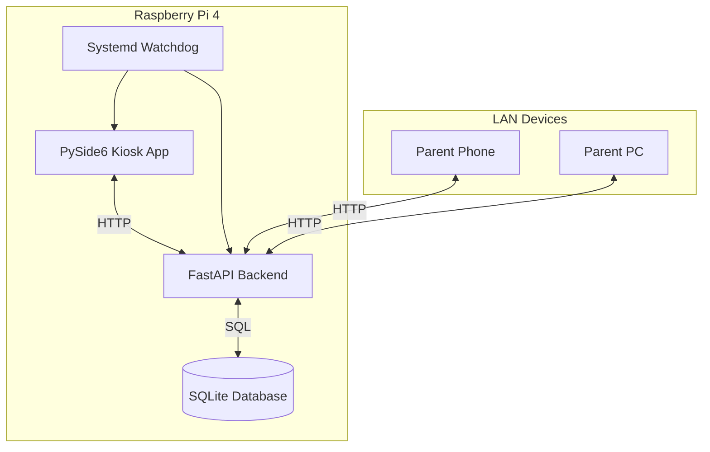

# Architecture Specification v0.1

## 1. High-Level Architecture
The system follows a Client-Server architecture, even though both client and server run on the same device. This ensures separation of concerns and allows the Admin User Interface to be served remotely.

## 2. Components

### 2.1. Backend Service (FastAPI)
- **Role:** Central source of truth. Handles business logic (tally, allowance), data persistence, and API serving.
- **Port:** 8000 (Internal & LAN exposed).
- **Responsibilities:**
    - Serve REST API for Kiosk and Admin UI.
    - Serve static HTML/JS for Admin UI.
    - Managed SQLite Connection & Migrations.
    - Automatic Background Jobs (Weekly Tally).

### 2.2. Kiosk Frontend (PySide6)
- **Role:** Child-facing interface.
- **Display:** Fullscreen (1024x600).
- **Input:** Touchscreen only.
- **Logic:** "Dumb" client. Fetches state from API, sends actions to API. No direct DB access.
- **Key Librarie:** `PySide6`, `requests` (or `aiohttp`).

### 2.3. Admin Frontend (Web)
- **Role:** Parent control panel.
- **Tech:** Single HTML file + Vanilla JS + CSS (Responsive).
- **Hosted:** Served by FastAPI as static content.

### 2.4. Data Storage (SQLite)
- **Location:** `/var/lib/chores_app/chores.db`
- **Backup:** Single file copy.

## 3. Data Flow

### 3.1. Chore Completion
1. Kid taps "Done" on Kiosk.
2. Kiosk sends `POST /api/chores/{id}/complete`.
3. Backend records completion in `chore_log` table with `status=pending`.
4. Backend re-calculates Kid Progress and returns new state.
5. Kiosk updates UI.

### 3.2. Parent Approval
1. Parent loads Admin Web Page.
2. Web UI fetches `GET /api/approvals/pending`.
3. Parent approves.
4. Web UI sends `POST /api/approvals/{log_id}/approve` (authenticated).
5. Backend updates `chore_log` status to `approved`.
6. Backend updates `ledger` if immediate reward (optional future feature, usually allowance is weekly).
7. Backend updates Official Progress.

## 4. Runtime & Deployment
- **OS:** Raspberry Pi OS Lite (recommended) or Desktop with X11.
- **Startup:**
    - `systemd` unit `chores-backend.service`: Starts FastAPI (Uvicorn).
    - `systemd` unit `chores-kiosk.service`: Starts X server (if lite) + PySide6 app.
    - Dependencies: `chores-kiosk` depends on `chores-backend`.
- **Environment:**
    - Python virtual environment: `/opt/chores_app/venv`.
    - Config: `/etc/chores_app/config.json`.
