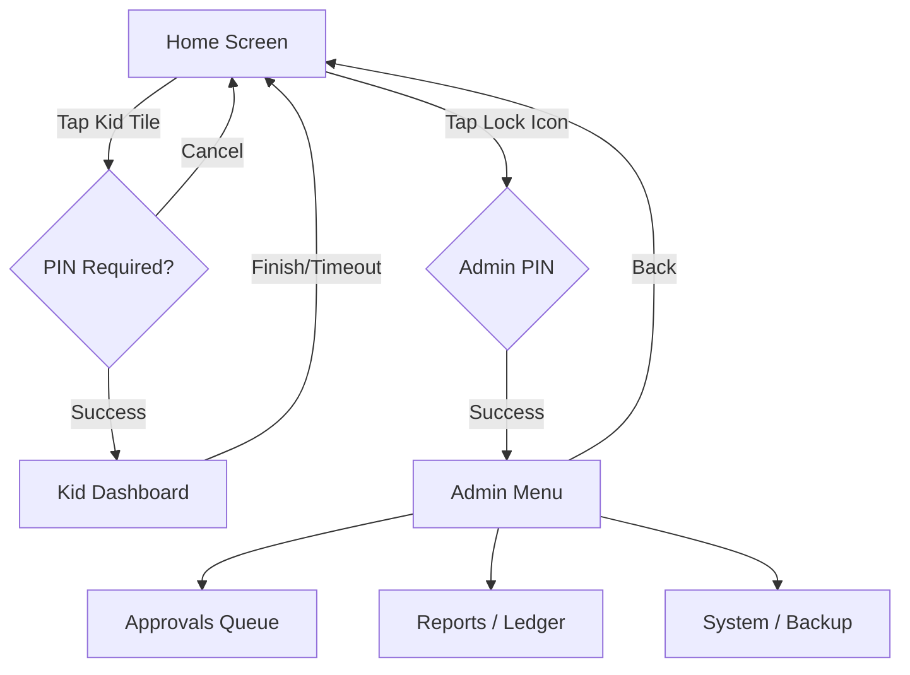

# Kiosk UI Specification v1.0

## 1. Environment & Constraints
- **Resolution:** 1024 x 600 (Landscape)
- **Input:** Capacitive Touch (No mouse/keyboard)
- **Platform:** Raspberry Pi 4 (OpenGL capable, but simple 2D preferred)
- **Framework:** PySide6 (Qt Quick or Widgets - Widgets preferred for simple robustness)

## 2. Touch Design Guidelines
- **Minimum Touch Target:** 48x48px (physical ~9mm).
- **Margins:** 16px between actionable elements.
- **Typography:**
  - Headers: 32px
  - Body: 20px
  - Buttons: 24px (Bold)
- **Scrollbars:** Hidden or Extra Wide (30px) for touch dragging.

## 3. Navigation Map

## 4. Screen Specifications

### 4.1. Global Header (Overlay)
- **Left:** App Title / Logo (Small).
- **Center:** Clock (HH:MM).
- **Right:**
  - Connectivity Icon (Green Wifi / Red X).
  - Sync Status (Spinner if syncing).
  - Admin Lock Button.

### 4.2. Home Screen
- **Layout:** Flex Grid (Centered).
- ** Components:** `KidTile`
  - Size: 250x300px.
  - Content: Large Avatar, First Name, "Balance: $12.00".
  - State: If tasks pending, show small red badge.

### 4.3. Kid Dashboard
- **Layout:** Two-Column Split (40% Left / 60% Right).
- **Left Column (Status):**
  - **Progress:** Circular or Bar chart. Show "Official" vs "Pending".
  - **Balance:** Large display.
  - **Streak:** "🔥 5 Day Streak!".
- **Right Column (Chores):**
  - `QListWidget` / ScrollArea.
  - **Chore Item:**
    - Height: 80px.
    - Icon (Left).
    - Label (Top), Description (Bottom).
    - Checkbox (Right) - Large (64x64px).
  - **Interactions:**
    - Tap Checkbox: Toggles state (Optimistic UI update, then API call).
    - If recurring chore done: Move to bottom or dim.

### 4.4. Admin Menu (PIN Protected)
- **Tab Widget:**
  1. **Approvals:**
     - List of `ChoreLog` items with status `PENDING`.
     - Actions: `Approve`, `Reject` (Swipe or Buttons).
     - "Approve ALL" floating action button.
  2. **Reports/Ledger:**
     - Select Kid.
     - View Transaction History (Simple List).
     - "Add Transaction" Button -> Dialog (Type, Amount, Note).
  3. **System:**
     - "Backup to USB" Button.
     - "Restore from USB" Button (Caution dialog).
     - "Update App" Button.
     - "Reboot" / "Shutdown".

## 5. Technical Behavior
- **Polling:**
  - Apps polls `GET /api/system/status` every 30s.
  - If Kid Dashboard open: Polls `GET /api/kids/{id}/chores` every 10s (to sync parent approvals).
  - `QTimer` drives all updates.
- **Offline Mode:**
  - If API unreachable:
    - Connectivity Icon = Red.
    - Disable actions requiring validation (or queue them - *Decision: Block for v0.1 to avoid sync conflicts*).
  - Error Toast: "Connecting to server..."
- **Timeout:**
  - If no interaction for 60s on Dashboard/Admin, auto-nav to Home.

## 6. Implementation Notes
- **Screens:** Implemented as `QWidget` classes in `kiosk/views/`.
- **Navigation:** `QStackedLayout` in `MainWindow`.
- **Keyboard:** Use `VirtualKeyboard` widget for Input fields (PIN, Amounts), as physical keyboard is absent.
